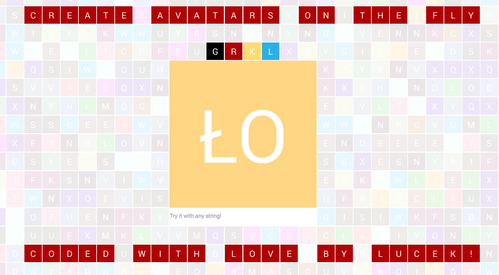

# avatarly

avatarly is a simple gem for creating gmail-like user avatars based on user email or any other string passed

inspired and influenced by https://github.com/johnnyhalife/avatar-generator.rb

# Demo

http://avatarly.herokuapp.com

## Installation

Avatarly requires ImageMagick to be installed.

### Gems

The gems are hosted at Rubygems.org. Make sure you're using the latest version of rubygems:

    $ gem update --system

Then you can install the gem as follows:

    $ gem install avatarly

### Bundler

Add to your Gemfile:

    gem "avatarly"

and then type:

    bundle install

## Usage

To generate image please do:

    Avatarly.generate_avatar(text, opts={})

the only required parameter is <tt>text</tt>. Other options that you can pass are:

* <tt>background_color</tt> (#AABBCC)
* <tt>font_color</tt> (#AABBCC)
* <tt>size</tt>  (default: 32)
* <tt>font</tt>  (path to font - e.g. "#{Rails.root}/your_font.ttf")
* <tt>font_size</tt> (default: size / 2)
* <tt>vertical_offset</tt> (default: 0)
* <tt>format</tt> (default: png)
* <tt>lang</tt> (language code if unicode aware upcase required - e.g: :tr, default: nil)
* <tt>separator</tt> (the custom string or regex used to split <tt>text</tt> into its initials)

As a result you will get an image blob - rest is up to you, do whatever you want with it.

For instance you can store avatar in directory with images:

      img = Avatarly.generate_avatar(text, opts={})
      File.open('public/images/avatar_name.png', 'wb') do |f|
        f.write img
      end

## License

MIT

# Maintainers and support

Thanks for help with the project:

[ Knapsack Pro](https://knapsackpro.com/?utm_source=github&utm_medium=readme&utm_campaign=avatarly-gem-readme) - learn [how to speed up Ruby and JavaScript tests with CI parallelisation](https://docs.knapsackpro.com/2020/how-to-speed-up-ruby-and-javascript-tests-with-ci-parallelisation)
